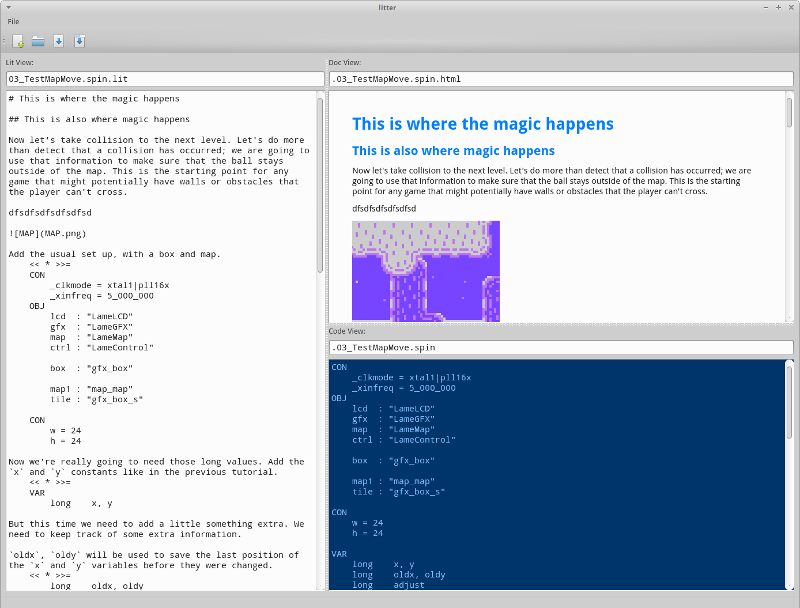

# litter - *a tiny editor for literate programming*

**litter** allows you to write code and documentation within the same source file but work on them as if they were separate.

litter depends on `lit`, a modern literate programming tool, which you can find here:

https://github.com/cdosborn/lit
